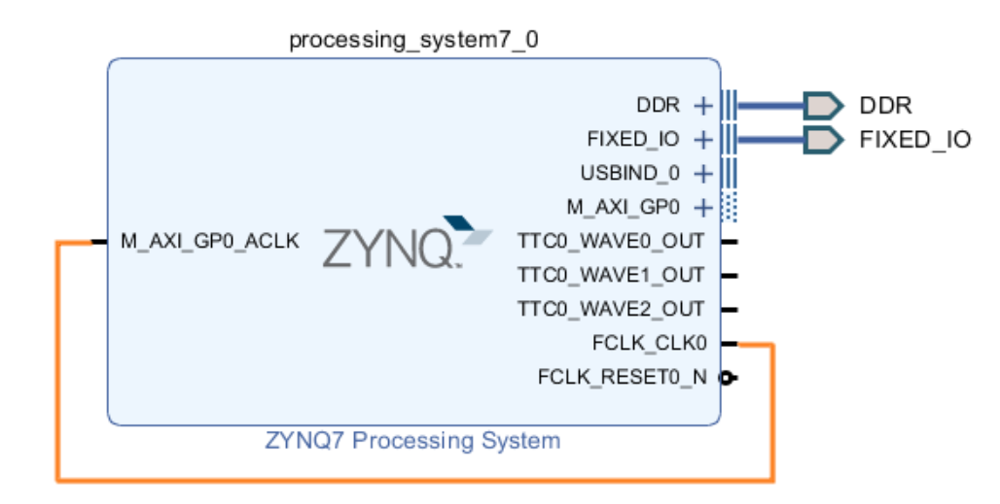
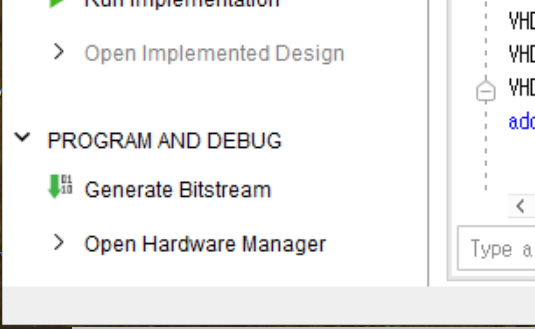
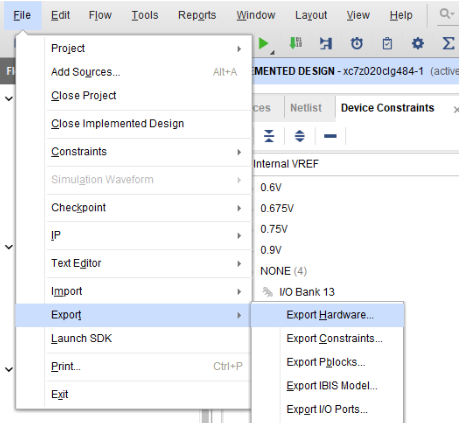
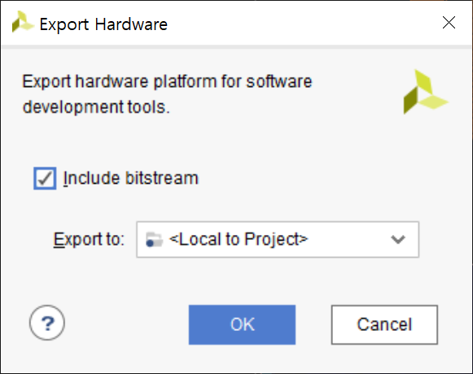
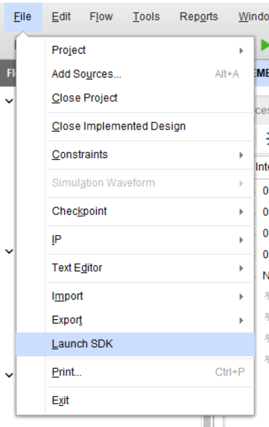
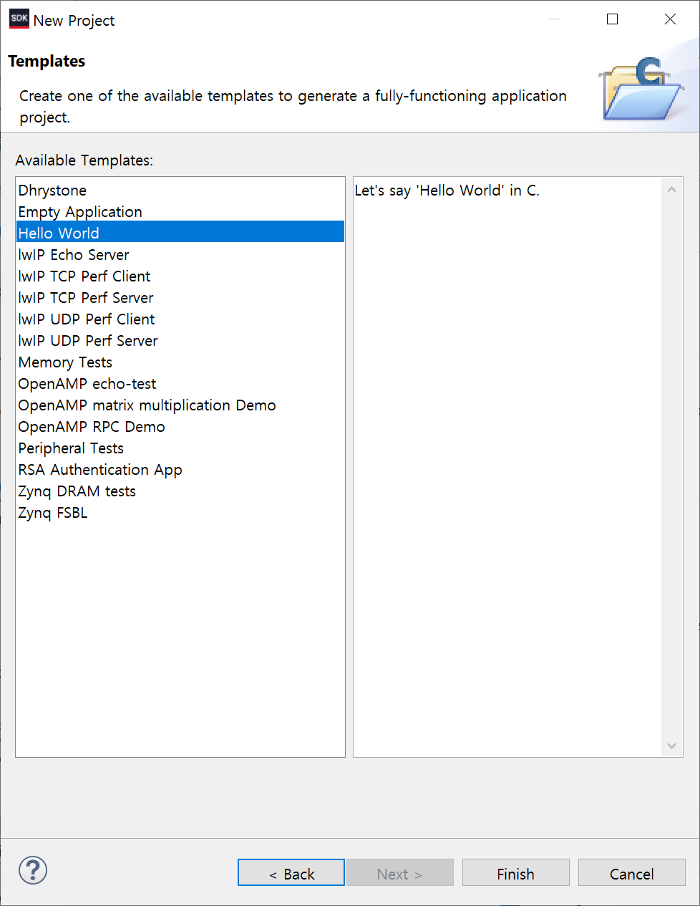
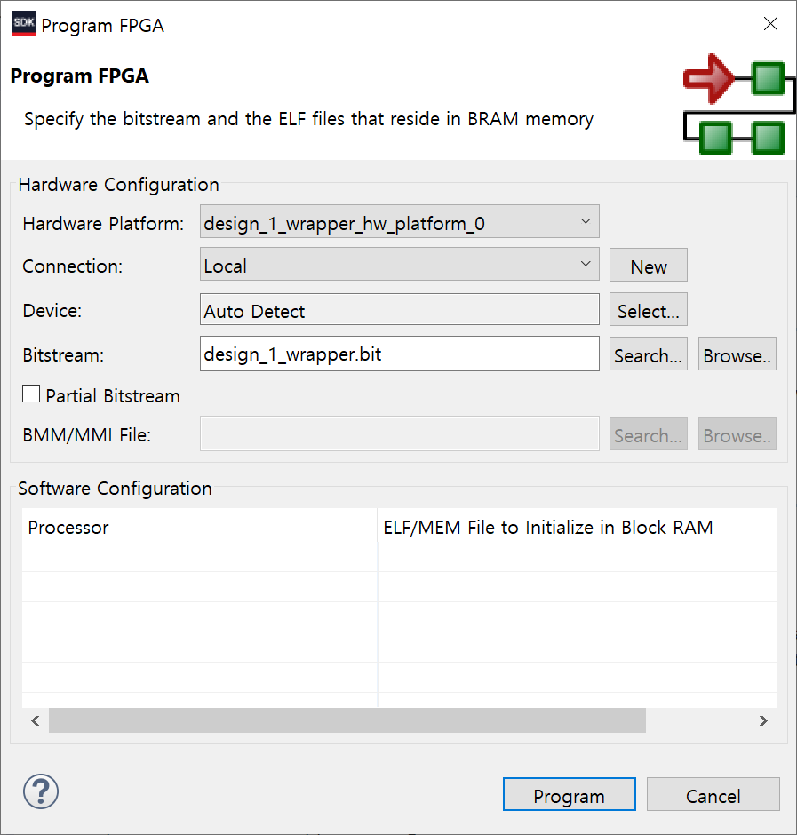
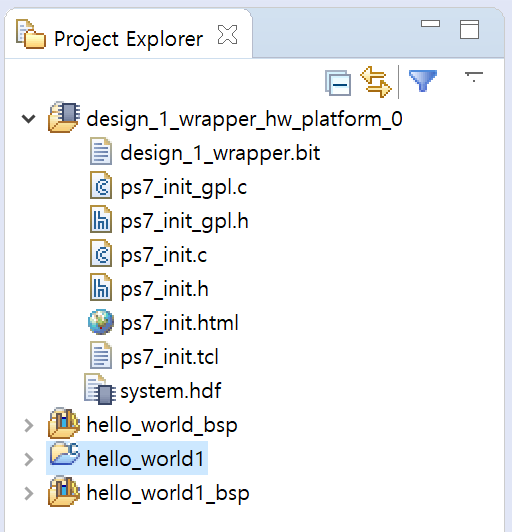

# FPGA Loopback using Zedboad
Zedboard에서 loopback을 구현해보자.
> Zedboard, Vivado v2018.2 (64-bit), Windows, Putty

***
## 2. Zedboard에 Loopback 구현하기
이 튜토리얼에서는 Vivado에서 제공되는 IP만을 사용하여 전송하는 데이터를 그대로 다시 반환하는 시스템을 구현한다. 이 과정은 5단계로 진행된다.
> Keyword : Loopback, AXI interface, AXI DMA  
> 이 튜토리얼은 이 [사이트](http://www.fpgadeveloper.com/2014/08/using-the-axi-dma-in-vivado.html)에서 소개된 튜토리얼을
대부분 그대로 따라가며, 이 [유튜브 채널](https://www.youtube.com/user/mamsadegh2/feed)에서 설명한 내용을 더하여 만들어졌다.

### 구현할 시스템
[출처](http://www.fpgadeveloper.com/2014/08/using-the-axi-dma-in-vivado.html)  
- Zynq PS: ARM Core와 DDR 메모리 컨트롤러가 포함되어 있다.  
[출처](https://www.youtube.com/watch?v=tnGzZA5VJ0M)  
- Zynq PL: AXI DMA 및 AXI 데이터 FIFO가 PL에 구현된다.  
- MM2S : Memory-Mapped to Streaming, S2MM : Streaming to Memory-Mapped  

### AXI 통신이란?
PS와 구현한 PL은 AXI 프로토콜 통신으로 이어진다. AXI master port는 트랜잭션을 보내고, AXI slave는 master가 보낸 트랜잭션을 받는다.  
AXI에는 여러 종류의 통신이 있다.
- AXI Lite : 적은 양의 데이터를 송수신할 때 쓰인다.
- AXI : AXI slave 는 데이터 주소 범위를 갖고 있어, master가 slave의 특정 주소에 원하는 데이터를 쓰도록 명령할 수 있다.
- AXI streaming (AXIS) : data flow application에 사용되며 AXI와 달리 주소범위를 지정하지 않는다.

### AXI DMA란?
DMA는 Direct Memory Access를 의미하며 메모리의 한 부분에서 다른 부분으로 데이터를 전송한다.

### Zedboard에 Loopback 구현하기
#### 2.1. RTL Project 생성하기
1. 새로운 RTL Project를 만들고 Flow Navigator - IP Integrator - Open Block Design을 클릭해, **1. Zedboard에 Base System 구현하기** 의 Block Design을 연다.  
  

2. Add IP에서 AXI Direct Memory Access를 더블 클릭하여 추가한다.  
  

3. 블록 디자인 상단 메세지의 Run Connection Automation을 클릭하고 /axi_dma_0/S_AXI_LITE를 선택한다.
  
  
  

4. Block Diagram의 Zynq block을 더블 클릭하고, PS-PL Configuration에서 HP Slave AXI Interface - S AXI HP0 Interface를 Enable한다.  
이 high performance AXI slave interface를 통해 AXI DMA를 연결할 수 있다.
  

5. 블록 디자인 상단 메세지의 Run Connection Automation을 클릭하고 /processing_system7_0/S_AXI_HP0를 선택한다.
  
  

6. 한 번 더 블록 디자인 상단 메세지의 Run Connection Automation을 클릭하고 /axi_dma_0/M_AXI_S2MM를 선택한다.
  

7. 한 번 더 블록 디자인 상단 메세지의 Run Connection Automation을 클릭하고 /axi_dma_0/M_AXI_MM2S을 선택한다.
  

8. Add IP에서 AXI4-Stream Data FIFO를 더블 클릭하여 추가한다.

9. FIFO와 DMA연결하기: FIFO의 `S_AXIS`포트와 AXI DMA의 `M_AXIS_MM2S`포트를 연결하고, FIFO의 `M_AXIS`포트와 AXI DMA의 `S_AXIS_S2MM`포트르 연결한다.  
   

10. FIFO의 clock과 reset을 설정하기: FIFO의 `s_axis_aclk`포트와 DMA의 `s_axi_lite_aclk`포트를 연결하고, FIFO의 `s_axis_aresetn`포트와 DMA의 `axi_resetn`포트를 연결한다.  
   

11. DMA에서 필요하지 않은 포트 제거하기: 블록 디자인에서 DMA를 더블 클릭하여 `Enable Control / Status Stream`옵션을 설정 해제한다.  

12. DMA 인터럽트를 PS에 연결하기: 먼저 Zynq PS block을 더블 클릭하여 Interrupts에서 Fabric Interrupts - PL-PS Interrupts Ports의 IRQ_F2P[15 :0]를 Enable한다.  
  

Add IP에서 `Concat`을 더블 클릭하여 추가한다.  
   

Concat의 `dout`포트와 Zynq PS의 `IRQ_F2P`포트를 연결한다.  
  

DMA의 `mm2s_introut`포트와 Concat의 `In0`포트를 연결한다.  
  

DMA의 `s2mm_introut`포트와 Concat의 `In1`포트를 연결한다.  
  

이로써 모든 Block Design은 끝이 난다.  

13. 만든 Block Design을 validate하기: Tools - Validate Design을 선택한다.
  
Validate Design이 성공적으로 끝나면 다음과 같은 창을 확인할 수 있다.
  

Regenerate Layout 아이콘을 클릭해 IP들을 정렬한다.  
  
  

#### 2.2. Generate Bitstream
1. Flow Navigator에서 PROGRAM AND BEDUG의 `Generate Bitstream`을 클릭하여 bitstream을 생성한다.
  

#### 2.3. Export hardware to Vivado SDK
> Vivado SDK로 Bitstream을 내보내고, Zynq 보드의 프로세서에서 실행할 소프트웨어를 개발한다. 개발할 소프트웨어는 DMA를 셋업하고 loopback을 확인한다.  

1. File 메뉴에서 Export - Export Hardware를 클릭한다.  
  

2. "Include bitstream"을 선택하고 OK를 누른다.  
  

3. File 메뉴에서 Launch SDK를 클릭하면 다음과 같은 창이 뜬다. OK를 누르면 Vivado SDK가 실행된다.  
   

#### 2.4. Create a software application
1. Vivado SDK의 File - New - Application Project를 클릭한다.
  

2. Project name을 입력하고 `Next`를 클릭한다.
  

3. Templates에서 Hello World를 선택하고 `Finish`를 클릭한다.
  

4. 이제 선택한 템플릿을 수정하여 우리의 디자인을 테스트할 수 있도록 한다.  
Project Explorer에서 `hello_world/src/helloworld.c`파일을 열고, `C:\Xilinx\SDK\(version)\data\embeddedsw\XilinxProcessorIPLib\drivers\axidma_v(ver)\examples\xaxidma_example_sg_poll.c`의 코드로 변경한다.

#### 2.5. Test the design on the hardware
> Bitstream과 software application을 생성하면, 이제 하드웨어에서 설계를 테스트해볼 수 있다.

1. Zedboard에 전원을 연결하고, USB 포트와 UART 포트를 연결한다.
- USB 포트: bitstream을 하드웨어에 보내 프로그래밍하고, excecutable 파일을 메모리에 보내고, 디버깅할 수 있도록 한다.
- UART 포트: PC의 console에 hello world를 출력한다.

2. Windows 설정 - 장치 - 장치 및 프린터 에서 Zedboard가 어떤 comport로 연결되어 있는지 확인한다.
이 컴퓨터에서는 COM6를 사용한다.
  

3. Putty를 실행하여 Serial Port를 COM6으로 연결한다.
  

4. SDK에서 Xilinx - Program FPGA를 클릭하고, `Program`을 클릭한다.
  
  

5. 왼쪽의 Program Explorer에서 hello_world1을 클릭하고, Run - Run As - Launch on Hardware (GDB)를 선택한다.
  
  

(6. Putty에 Hello world가 출력된 것을 확인할 수 있다.)  
