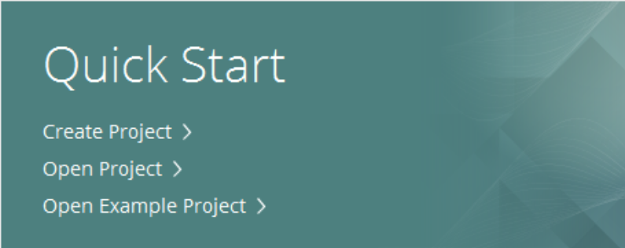
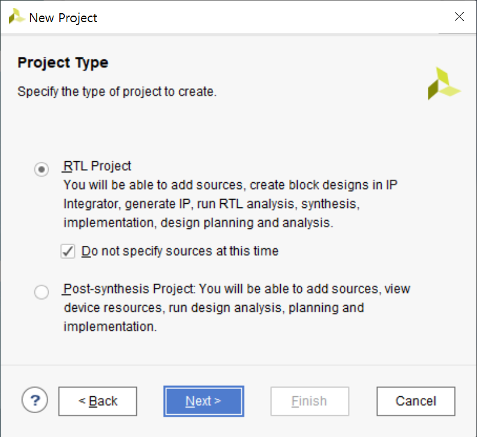
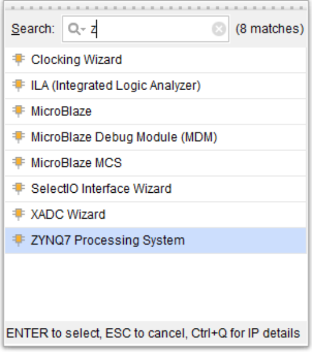
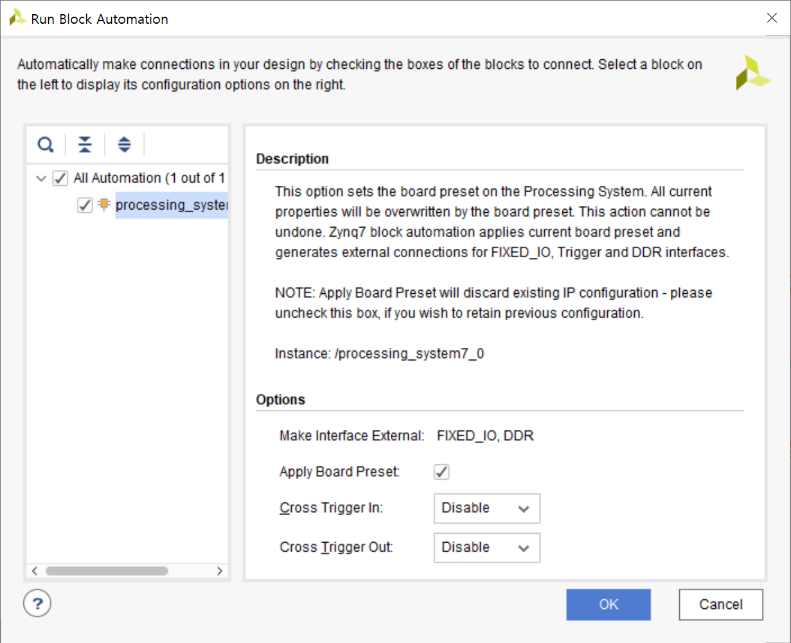
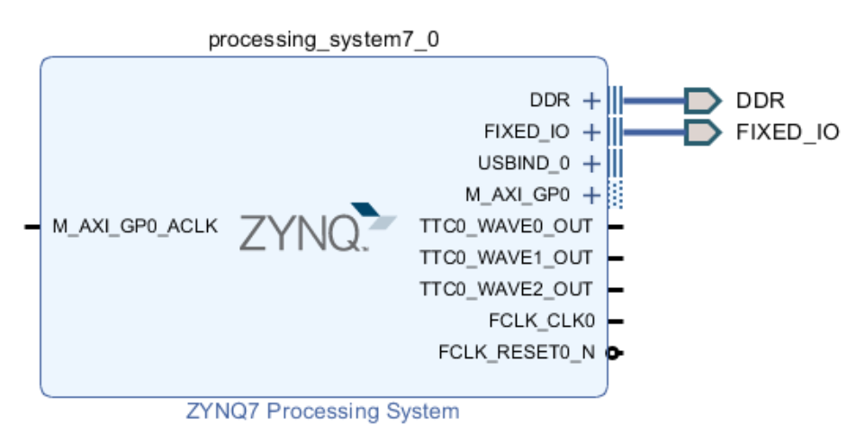
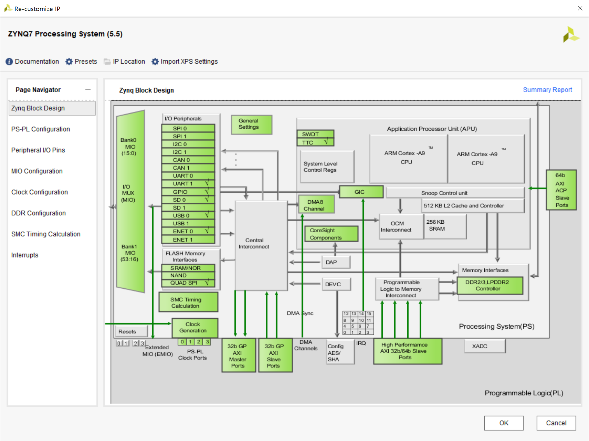

# FPGA Loopback using Zedboad
Zedboard에서 loopback을 구현해보자.
> Zedboard, Vivado v2018.2 (64-bit), Windows
***
## Vivado 다운받기
#### 다운로드
[여기](https://www.xilinx.com/support/download.html)에서 회원가입 후 WebPACK(무료 버젼)을 설치한다. 이 튜토리얼에서는 Vivado v2018.2 (64-bit)를 윈도우에서 사용한다.
#### 설치
설치가 완료되면 xsetup.exe를 실행하여 설치한다.
#### 라이센스 등록
[라이센스 센터](https://www.xilinx.com/getlicense)에서 ISE WebPACK License를 다운받는다. Manage Xilinx License 프로그램을 실행시켜 Load License 메뉴에서 Copy License를 클릭해 다운받은 라이센스를 등록한다.

##### 다운받은 프로그램들
1. Vivado design suite  

2. Vivado HLS : High Level Synthesis  
C, C++로 쉽게 FPGA를 프로그래밍하고 보드의 CPU에 소프트웨어를 돌릴 수 있도록 한다.

3. Vivado SDK : Software Development Kit

***
## 1. Zedboard에 Base System 구현하기
Zynq 보드에 아무 기능을 하지 않는 시스템을 구현하고, 이를 간단한 소프트웨어와 함께 보드에 프로그래밍한다. CPU가 간단한 어플리케이션을 실행하여 컴퓨터의 console에 Hello world를 출력하도록 한다. 이 과정은 6단계를 통해 진행된다.
(참고한 [사이트](http://www.fpgadeveloper.com/2014/07/creating-a-base-system-for-the-zynq-in-vivado.html)와 [유튜브](https://www.youtube.com/user/mamsadegh2/feed))
> Keyword : PL vs PS, AXI interface, Bitstream, Vivado SDK, xmd

### 1.1. 새로운 Vivado Project 만들기
1. Vivado design suit 프로그램을 실행하면 다음과 같은 시작화면이 나온다. create project을 선택한다.  
  

2. project name을 입력하고, next를 클릭한다.  
  

3. RTL Project를 선택하고, next를 클릭한다.  
RTL(register-transfer-level) project는 Verilog나 VHDL과 같은 HDL(hardware description language) 코드로 작성된 프로젝트를 말한다.

4. Parts | Boards 중 Boards에서 Zedbarod Zynq Evaluation and Development Kit을 선택하고, `Next`를 클릭한다.  
  

5. Finish를 클릭하면, 새로운 프로젝트가 생성된다.  
  

### 1.2. Zynq PS 셋업하기
1. 왼쪽의 Flow Navigator의 IP INTEGRATOR 부분에서 `Create Block Design`을 클릭한다.
  

2. 다음과 같은 창에서 Ok를 누르면, Block design이 생성된다.
Block design에서 Zynq PS와 PL부분을 디자인할 수 있다. 이 튜토리얼에서는 PS부분만 다룬다.
- Programmable logic (PL) : 사용자가 vivado에서 제공되는 여러 IP를 추가하거나, 직접 모듈을 설계하여 원하는 동작을 구현할 수 있다.
- Processing system (PS) : hardwired된 블록으로 CPU, 여러 memory interface 등이 있다. PS에서 Linux, FreeBSD, Windows 등의 운영체제를 올릴 수도 있고, stand alone 프로그램을 바로 실행시킬 수 있다.
  

3. `+` 버튼을 누르면 IP catalog 창이 뜬다. ZYNQ7 Processing System을 두 번 클릭하여 불러온다.
이 IP가 FPGA 보드의 PS이며 사용할 기능을 세부적으로 설정하고 추가하여 사용할 수 있다. 선택한 기능의 Input/output은 위의 블록디자인에 반영된다.  
  

4. Block Automation을 실행한다.
PS를 불러오면 Designer Assistance Avalable. 이라는 메세지가 뜬다. 메세지의 `Run Block Automation`을 클릭한다. 다음과 같이 설정하고 OK를 클릭하면, FIXED_IO와 DDR 핀에 자동으로 할당된다.  
  

5. clock를 활성화하고 AXI bus 뭐시기
먼저 Zynq PS를 이중클릭하여 Re-customize IP 창을 연다.  
PAGE Navigator의 Clock Configutation을 선택하고, PL Fabric Clocks에서 FCLK_CLK0의 frequency를 100MHz로 설정하고 OK를 눌러 설정을 저장한다.  
  

6. FCLK_CLK0과 M_AXI_GP0_ACLK를 연결한다.
  

### 1.3. HDL Wrapper 생성하기

### 1.4. Bitstream 생성하기

### 1.5. 하드웨어를 Vivado SDK로 내보내기

### 1.6. 소프트웨어 개발

### 1.7. Test

***
## 2. Zedboard에 Loopback 구현하기
